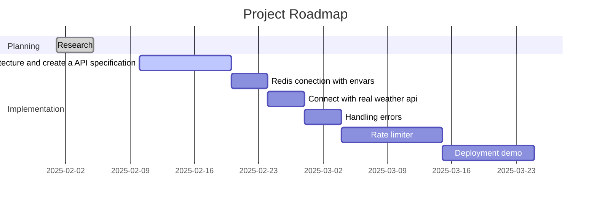

# Weather API Service

API created in go to solve this problem https://roadmap.sh/projects/weather-api-wrapper-service

# Roadmap

```mermaid
gantt
    title Project Roadmap
    dateFormat  YYYY-MM-DD
    section Planning
    Research                :done, 2025-02-01, 2025-02-05
    section Implementation
    Create simple API with hardcoded response, use clean architecture and create a API specification    :active, 2025-02-10, 2025-02-20
    Redis conection with envars     :2025-02-20, 2025-02-24
    Connect with real weather api        :2025-02-24, 2025-02-28
    Handling errors     :2025-02-28, 2025-03-04
    Rate limiter : 2025-03-04, 2025-03-15
    Deployment demo :2025-03-15, 10d
```
