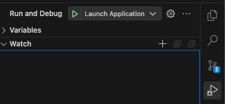
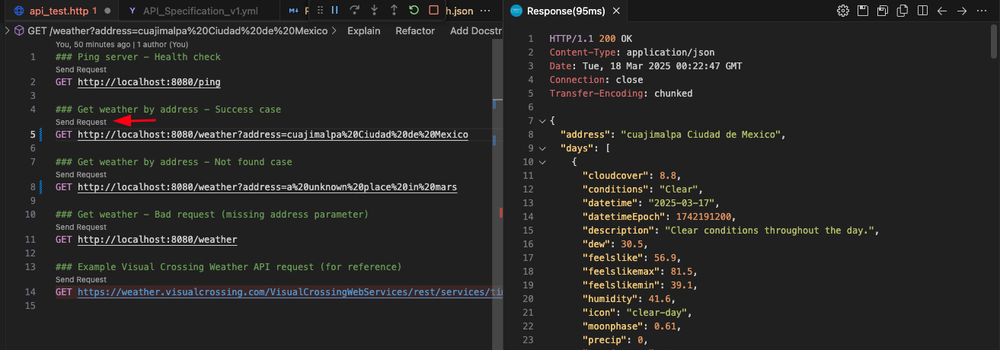

# Weather API Service

API created in go to solve this problem [Weather API Wrapper Service](https://roadmap.sh/projects/weather-api-wrapper-service)

## Setup

### Prerequisites, tech stacks & tools

- Have an API key for [Visual Crossing](https://www.visualcrossing.com/)
- Go
- Redis
- Podman and [podman-compose](https://github.com/containers/podman-compose) (suggested)
- or Docker and [docker compose](https://docs.docker.com/compose/)
- Visual Studio Code (suggested)
- Install [Go extension](https://marketplace.visualstudio.com/items?itemName=golang.go) for VsCode
- Install [Rest Client extension](https://marketplace.visualstudio.com/items?itemName=humao.rest-client) for VsCode (suggested)

### Setup dependencies

This will create a local development environment with a Redis server.

Using podman and podman-compose (suggested) and positioning in the root of the project

```bash
podman-compose --file ./_devenv/docker-compose.yml --project-name weather-service up -d
```

Using docker compose

```bash
docker compose --file ./_devenv/docker-compose.yml --project-name weather-service up -d
```

### How to run the application using VsCode

1. Have the development environment running
2. Open the project in VsCode
3. Copy the example env file and rename it to `.env` and add your Visual Crossing API key
4. With Visual Studio Code open run the application using the launch configuration
5. You can test the API using the rest client file `api_test.http`

Image of running the application



Image of testing the API




### API Specification

The API specification is available in [API Specification v1](./API_Specification_v1.yml)

Also you can check an example of the response in [Example Response](./_devenv/example-response.json)